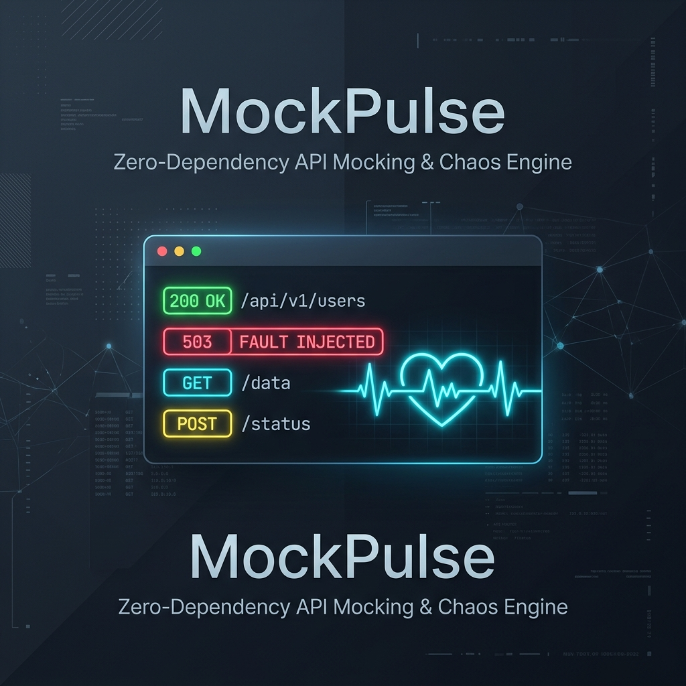

# ⚡ MockPulse



> **Zero-Dependency Local API Mocking & Chaos Fault Injection Engine**  
> *Architected with pure Python standard libraries. Zero pip installs. Instant startup.*

[](https://www.python.org/)
[-brightgreen.svg)]()
[]()
[]()

📖 **Documentation:** [English Guide (GUIDE_EN.md)](GUIDE_EN.md) | [Polski Przewodnik (GUIDE_PL.md)](GUIDE_PL.md) | [System Architecture (architecture.md)](architecture.md)

---

## 🎯 The Problem & The Solution

When developing microservices or testing frontend integrations, developers frequently depend on 3rd-party external APIs (payment gateways, notification services, identity providers). 
- **The Problem:** Testing edge cases—such as sudden `503 Service Unavailable` failovers, `429 Rate Limits`, and 800ms network jitter—is nearly impossible with static staging sandboxes. Existing tools (Docker mocks, WireMock, Prism) are heavy, slow to boot, or require complex environments.
- **The Solution:** **MockPulse** is a lightweight, zero-dependency engine that boots in **< 15 milliseconds**, reads a declarative `routes.json`, injects statistical network faults (Chaos Engineering), and provides real-time P95/P99 latency telemetry—all using standard Python modules (`http.server`, `threading`, `json`, `re`).

---

## 🌟 Key Features

- 🪶 **Zero External Dependencies:** Built entirely with standard Python libraries. No `pip install`, no `virtualenv`, no CVE bloat.
- ⚡ **Sub-15ms Startup:** Ready to serve traffic instantaneously.
- 💥 **Chaos Engineering & Fault Injection:** Configurable failure rates (e.g. 25% chance of returning HTTP 503 with custom headers).
- ⏱️ **Latency & Jitter Simulation:** Realistic network delays with randomized ranges (e.g. uniform jitter between 300ms and 750ms).
- 🔄 **Zero-Downtime Hot Reloading:** Modify `routes.json` on the fly; updates are detected via filesystem metadata and atomically swapped without dropping active connections.
- 🌐 **Universal CORS Support:** Full automated preflight `OPTIONS` handling with `Access-Control-Allow-*` headers—seamlessly works with React, Vue, Next.js, and mobile apps out of the box.
- 🕵️ **Integration Test Spying (`/_mockpulse/history`):** Inspect received request payloads, headers, and query parameters in your Pytest, Jest, or Cypress suites with a clear endpoint (`DELETE /_mockpulse/history`).
- 📐 **RFC Compliant:** Strict HTTP semantics including distinct `405 Method Not Allowed` responses with `Allow` headers.
- 📦 **Pip Installable CLI:** Optional global install (`pip install .`) exposing the `mockpulse` binary anywhere in your shell.

---

## 🏗️ Architecture at a Glance

```
[ Client / VS Code REST Client / curl ]
                   │
                   ▼ (TCP Socket :8080)
┌────────────────────────────────────────────────────────┐
│  ThreadingHTTPServer (mockpulse/server.py)             │
│  - Multi-threaded connection listener                  │
└──────────────────────────┬─────────────────────────────┘
                           │ Spawn Worker Thread
                           ▼
┌────────────────────────────────────────────────────────┐
│  MockPulseRequestHandler (mockpulse/handler.py)        │
│  - Body / Query / Header parsing                       │
│  - Hot-reload check on routes.json                     │
└──────────────┬───────────────────────────┬─────────────┘
               │                           │
               ▼                           ▼
┌──────────────────────────────┐ ┌───────────────────────┐
│ Router (mockpulse/router.py) │ │ Chaos Engine          │
│ - Compiled Regex matcher     │ │ (mockpulse/chaos.py)  │
│ - Path param extraction      │ │ - Latency Jitter      │
│ - RFC 404 vs 405             │ │ - % Fault Injection   │
└──────────────┬───────────────┘ └───────────┬───────────┘
               │                             │
               └──────────────┬──────────────┘
                              ▼
┌────────────────────────────────────────────────────────┐
│  Telemetry & Terminal Logger (metrics.py / logger.py)  │
│  - In-Memory Ring Buffer (P50 / P95 / P99)             │
│  - Colorized ANSI request logger                       │
└────────────────────────────────────────────────────────┘
```

For the complete architectural design, trade-offs, and concurrency rationale, see [architecture.md](architecture.md).

---

## 🚀 Quickstart (Under 30 Seconds)

### 1. Clone & Run
No dependencies to install! Just run:
```bash
python3 main.py
```

### 2. Available CLI Flags
```bash
python3 main.py --help

Options:
  --host TEXT         Host address to bind (default: 127.0.0.1)
  --port INTEGER      TCP port to listen on (default: 8080)
  --config PATH       Path to routes configuration file (default: routes.json)
  --no-hot-reload     Disable filesystem hot-reloader
  --quiet             Suppress ANSI request logging
```

---

## 🛠️ Declarative Configuration (`routes.json`)

Configure endpoints, status codes, simulated delays, and chaos injection in a clean JSON format:

```json
{
  "routes": [
    {
      "method": "POST",
      "path": "/api/v1/payments/charge",
      "status_code": 200,
      "response": { "status": "succeeded", "amount": 4999 },
      "latency": {
        "delay_ms": 250
      },
      "fault": {
        "rate": 0.25,
        "status_code": 503,
        "response": { "error": "GatewayTimeout", "retry_after": 2 },
        "headers": { "Retry-After": "2" }
      }
    },
    {
      "method": "GET",
      "path": "/api/v1/shipping/rates",
      "status_code": 200,
      "response": { "service": "FedEx", "rate": 45.0 },
      "latency": {
        "jitter_min_ms": 300,
        "jitter_max_ms": 750
      }
    },
    {
      "method": "GET",
      "path": "/api/v1/users/{id}",
      "status_code": 200,
      "response": { "user_id": "{id}", "role": "Engineer" }
    }
  ]
}
```

---

## 🧪 Interactive Testing with VS Code

Open [test_scenarios.http](test_scenarios.http) directly in VS Code with the **REST Client** extension. Click **Send Request** above any scenario:

1. **`GET /health`** → Fast healthcheck (200 OK)
2. **`POST /api/v1/payments/charge`** → Flaky payment gateway (~25% of requests return 503 Service Unavailable)
3. **`GET /api/v1/shipping/rates`** → Jitter latency simulation (300ms–750ms variable delay)
4. **`GET /api/v1/users/usr_42`** → Path parameter extraction
5. **`GET /_mockpulse/metrics`** → Live server performance & percentile stats

---

## 🧪 Automated Test Suite

MockPulse includes a complete test suite covering the router, configuration manager, chaos distribution, metrics percentiles, and concurrency:

```bash
python3 -m unittest discover tests -v
```
*(All 16 tests execute in ~0.06 seconds with zero external test runners).*

---

## 💼 Technical Interview Talking Points (Staff / Senior Level)

When discussing MockPulse in technical interviews, highlight these engineering principles:

1. **Why Standard Library over FastAPI/Flask?**  
   *"Most developers can write `@app.get('/users')`, but building the underlying socket transport, HTTP framing, URL regex parameter extraction, and RFC 405 compliance demonstrates a deep mastery of how network protocols actually function beneath high-level frameworks."*
2. **Thread-per-Request vs Asyncio for Chaos Injection:**  
   *"In an async event loop, a blocking `time.sleep` halts the entire event cycle unless carefully offloaded. By utilizing `ThreadingHTTPServer`, simulated latency pauses only the calling thread in kernel space, leaving other concurrent client connections completely unaffected."*
3. **Zero-Downtime Hot-Reloading:**  
   *"We inspect `os.stat(mtime)` on incoming requests—a sub-microsecond VFS check. If changed, the new routing graph is compiled in isolation and swapped atomically via a lightweight pointer lock, eliminating request drops during configuration updates."*

---

## 📢 LinkedIn Post Template

Feel free to copy and customize this post to share your project on LinkedIn:

```text
🚀 Excited to open-source "MockPulse": A Zero-Dependency Local API Mocking & Fault Injection Engine built entirely in Python.

When building microservices, testing how your system handles flaky 3rd-party APIs (like a payment provider returning 503s or a carrier with 600ms latency jitter) is often painful with heavy Docker-based tools.

I built MockPulse to solve this locally with zero external dependencies (no pip install required):
⚡ Boots in < 15ms with under 20MB of memory
💥 Built-in Chaos Engineering: Probabilistic fault injection (% error rates)
⏱️ Realistic Latency Jitter (Uniform / Gaussian sleep ranges)
🔄 Zero-Downtime Hot-Reloading via atomic reference swapping
🧵 Multi-threaded concurrency with ThreadingHTTPServer
📊 Live P50, P90, P95, P99 in-memory latency telemetry

Building this from scratch using pure Python socket mechanics and RFC-compliant HTTP parsing was an incredible deep-dive into network protocols and systems programming.

Check out the code and architecture documentation on GitHub! 👇
👉 https://github.com/RmznSd13/MockPulse

#Python #SoftwareEngineering #SystemDesign #ChaosEngineering #Backend #Microservices
```

